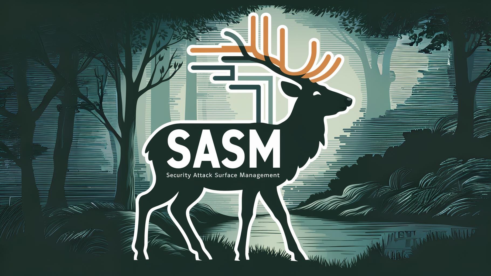

# SASM ( Security Attack Surface Management )



## Table of Contents
- [Description](#description)
- [Installation](#installation)
- [Usage](#usage)
- [Contributing](#contributing)
- [License](#license)
- [Contact](#contact)

## Description
### "SASM: Security Attack Surface Management"</br> is automatically identifies assets that span across an organization's entire IT infrastructure and provides continuous security management for exposed attack surfaces.

## Installation
Step-by-step instructions on how to install and set up the project.

```bash
# Clone the repository
git clone https://github.com/yourusername/project-name.git

# Change directory
cd project-name

# Install dependencies
npm install
```

## Usage
Instructions on how to use the project after installation.

```bash
# Run the project
npm start
```

## Contributing
Guidelines for contributing to the project, including the code style guide and the process for submitting pull requests.

## License
This project is licensed under the MIT License - see the [LICENSE](LICENSE) file for details.

## Contact
If you have any questions, feel free to reach out to us at [email@example.com](mailto:email@example.com).
